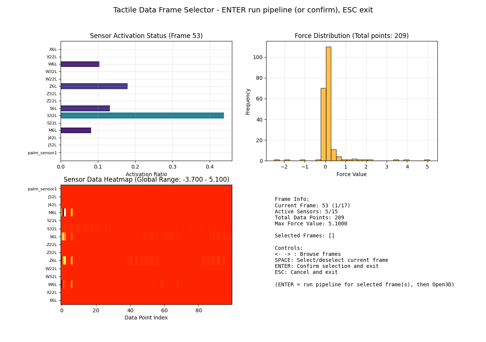
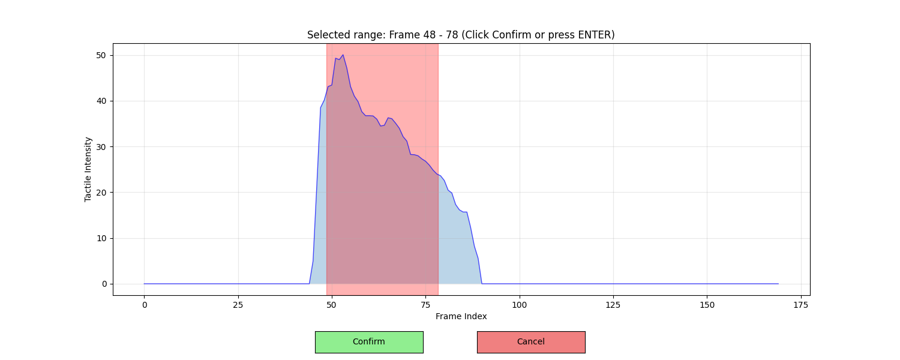
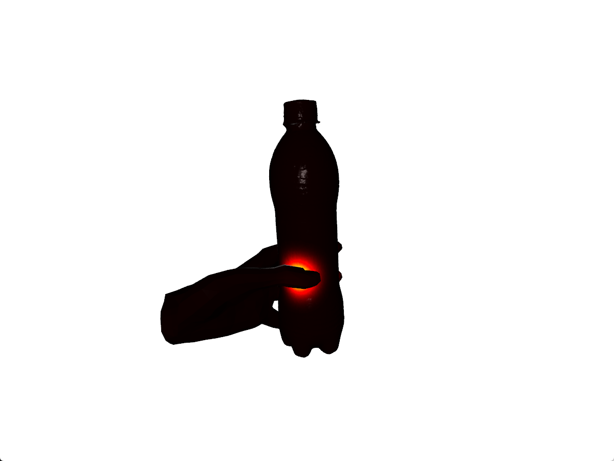
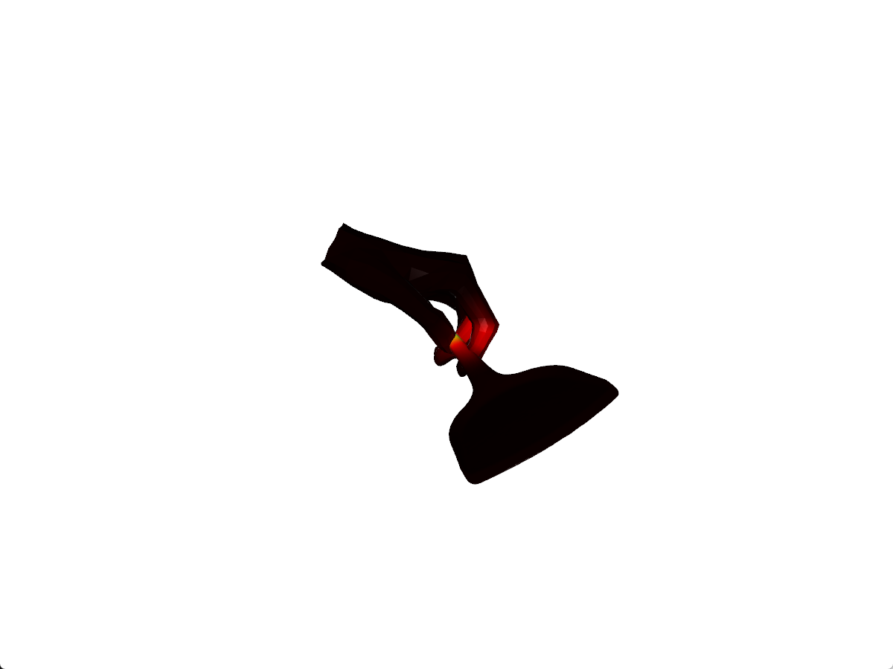
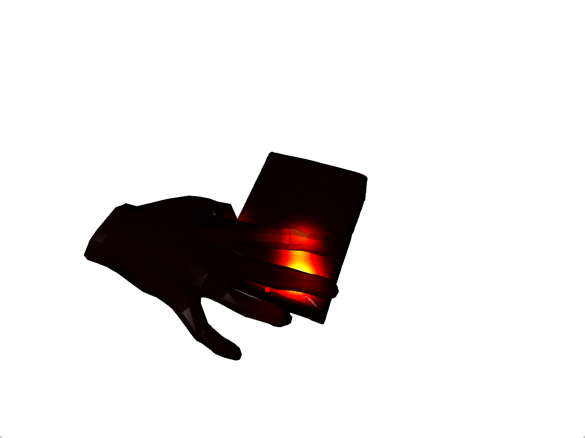

# Visualizing Touch

A toolkit for tactile projection and pressure visualization based on HDF5 tactile data and OBJ object meshes: frame selection, coordinate transformation, pressure computation, Gaussian pressure distribution, and Open3D visualization.

---

## 1. Environment Setup (Conda)

### 1. Install Miniconda / Anaconda

If you have not installed Conda yet, please install one of the following:

- **Miniconda** (recommended, lightweight): <https://docs.conda.io/en/latest/miniconda.html>
- **Anaconda**: <https://www.anaconda.com/download>

After installation, restart your terminal and verify:

```bash
conda --version
```

### 2. Create and Activate Environment

In the project root directory, run:

```bash
# Go to project directory
cd e:\data\pipeline\Visualizing_touch

# Create environment from environment.yml
conda env create -f environment.yml

# Activate environment
conda activate visualizing_touch
```

If an environment with the same name already exists, remove it first:

```bash
conda env remove -n visualizing_touch
conda env create -f environment.yml
conda activate visualizing_touch
```

### 3. Optional: Install Dependencies Manually

If you do not want to use `environment.yml`, you can create the environment and install packages manually:

```bash
conda create -n visualizing_touch python=3.9 -y
conda activate visualizing_touch

# Core dependencies (recommend installing PyTorch and Open3D via conda)
conda install numpy scipy h5py opencv matplotlib pytorch open3d -c pytorch -c conda-forge -y
```

### 4. Optional: Video Decoding (ffmpeg)

If you need to decode camera videos from HDF5 (e.g., h265 decoding in `read_tactile`), please install **ffmpeg** and add it to PATH:

- Windows: <https://ffmpeg.org/download.html> or `winget install ffmpeg`
- After installation, run `ffmpeg -version` in the terminal to verify.

---

## 2. Configuration and Data

- **Default paths** are configured in `view_tactile_tool/config.py`:
  - `DEFAULT_HDF5_PATH`: tactile HDF5 files (e.g. `data/hdf5/100017/episode_*.hdf5`)
  - `DEFAULT_OBJ_PATH`: object OBJ meshes (e.g. `data/obj/obj_100017/baishikele.obj`)
  - `MANO_ASSETS_ROOT`: MANO asset directory (default `mano_v1_2`)
- Put your HDF5 and OBJ files into the corresponding directories, or directly modify these paths.

---

## 3. How to Run

With the Conda environment **activated**, run the following commands in the project root:

### Main Entry (Frame Selection + Full Pipeline)

```bash
# Open the frame selection UI; after picking frames, press ENTER to run the full pipeline
python view_tactile_tool.py
# or
python -m view_tactile_tool
```

### Subcommands

| Command | Description |
|--------|-------------|
| `python view_tactile_tool.py select_frames` | Only visualize and select frames, then save results |
| `python view_tactile_tool.py test_transform` | Test coordinate transformations |
| `python view_tactile_tool.py test_pressure` | Test pressure computation |
| `python view_tactile_tool.py test_gaussian` | Test Gaussian pressure distribution |
| `python view_tactile_tool.py test_open3d` | Test Open3D pressure visualization |
| `python view_tactile_tool.py --frame N test_open3d` | Visualize Open3D pressure for frame N |

Compatible entry points (equivalent to the above):

```bash
python proj_point_to_obj.py
python proj_point_to_obj.py select_frames
# ...
```

### Frame Selection Controls

- **← / →**: switch frames  
- **Space**: select / deselect current frame  
- **Enter**: confirm and save selected frames (optionally continue to run the pipeline)  
- **ESC**: cancel  

Selected frames are saved to `output/selected_frames.txt` and `output/selected_frames.json`.

---

## 4. Visualization Examples

Frame selection and tactile overlay:

<p>
  
  
</p>

Pressure cloud visualization:

<p>
  
  
</p>

<p>
  
</p>

---

## 5. Project Structure Overview

```
Visualizing_touch/
├── environment.yml       # Conda environment definition
├── README.md             # This document
├── view_tactile_tool.py  # Main entry
├── proj_point_to_obj.py  # Compatible entry
├── read_tactile.py       # HDF5 tactile data loading & decoding
├── view_tactile_tool/    # Tactile visualization package
│   ├── config.py         # Paths and global configuration
│   ├── frame_selection.py # Frame selection UI & pipeline orchestration
│   ├── transform.py      # Coordinate transformations
│   ├── pressure.py       # Pressure computation
│   ├── gaussian.py       # Gaussian pressure distribution
│   ├── open3d_viz.py     # Open3D pressure visualization
│   └── ...
├── data/
│   ├── hdf5/             # HDF5 tactile data
│   ├── obj/              # OBJ object meshes
│   └── video/            # Decoded videos (optional)
├── output/               # Selected frames and output figures
├── mano_v1_2/            # MANO hand model assets
├── manopth/              # MANO PyTorch layers (optional)
└── manotorch/            # MANO PyTorch utilities (optional)
```

---

## 6. FAQ

- **Frame selection UI not responding on Windows**: The entry script already sets `matplotlib.use("TkAgg")`. If issues persist, please make sure Tk is installed (Conda usually includes Tk by default).
- **HDF5 or OBJ not found**: Check `DEFAULT_HDF5_PATH` and `DEFAULT_OBJ_PATH` in `view_tactile_tool/config.py` and ensure they point to existing files.
- **Video decoding errors**: Make sure ffmpeg is installed and in PATH. If you do not need video decoding, you can ignore related errors.
- **MANO / hand-related errors**: The main pipeline currently targets exoskeleton hand data. MANO data requires additional configuration; see `data/hdf5/mano_tactile.md`.

---

## 7. Dependency Summary

| Dependency | Purpose |
|-----------|---------|
| Python 3.9 | Runtime environment |
| numpy, scipy | Numerical and geometric computation |
| h5py | HDF5 I/O |
| opencv | Image / video processing |
| matplotlib | Frame selection UI and plotting |
| pytorch | Tactile data processing (`read_tactile`, etc.) |
| open3d | 3D visualization of pressure clouds |
| ffmpeg (optional) | Camera video decoding |

After the environment is created, start from **“Configuration and Data”** and **“How to Run”**, adjust the paths if necessary, and you should be ready to go.
